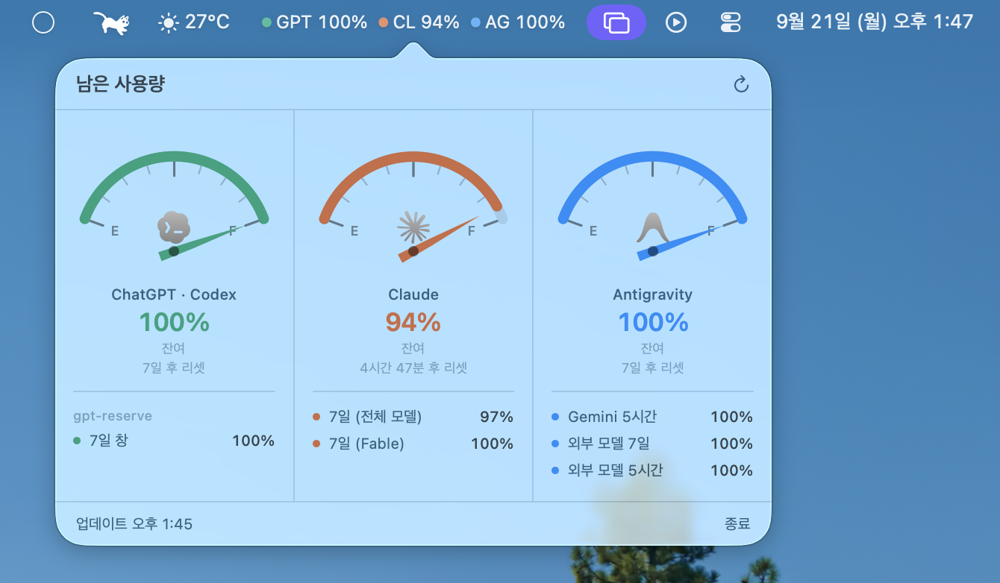

# Unified Usage Monitor

> LANGUAGE: **English** · [한국어](README.ko.md)

Check your Claude · ChatGPT (Codex) · Antigravity subscription usage all in one place, right from the macOS menu bar.



## Supported out of the box

Claude, ChatGPT Codex, and Antigravity are supported.
Every poll checks whether each is installed, and a detected tool is added to the popover and menu bar UI.

| Tool        | Detected by                                                                                    |
| ----------- | ----------------------------------------------------------------------------------------------- |
| Claude Code | Keychain `Claude Code-credentials`, `~/.claude`, `~/.local/share/claude`, `~/.local/bin/claude` |
| Codex       | `~/.codex`, `~/.codex/auth.json`                                                                 |
| Antigravity | Keychain `gemini`/`antigravity`, `~/.gemini/antigravity-cli`, `~/.antigravity`                  |

> This uses undocumented private APIs, so an update to Claude Code, Codex, or Antigravity can break usage reporting. A matching fix is always in progress when that happens — please bear with us.

## Requirements

- macOS 14.0 or later
- Apple Silicon or Intel
- To build it yourself: Xcode Command Line Tools — full Xcode is not needed

---

## Install

### Download the release app

Grab the zip from [Releases](https://github.com/poca-p0ca/UnifiedUsageMonitor/releases) and move `UnifiedUsageMonitor.app` to `/Applications` in Finder.

- **Gatekeeper blocks the first launch.**
  The app isn't notarized with an Apple Developer ID, so `spctl` rejects it.
  Double-click it, dismiss the warning, then go to **System Settings → Privacy & Security**,
  find the "UnifiedUsageMonitor was blocked" line near the bottom, and click **Open Anyway**.
  You only need to do this once, right after installing.

  > On macOS 14 you can instead Control-click the app → Open.
  >
- **The first launch asks for keychain access once per service. Choose "Always Allow."**

  > Choosing "Allow" makes it ask again every time.
  >

### Build it yourself

Requires Command Line Tools.

```bash
git clone https://github.com/poca-p0ca/UnifiedUsageMonitor.git
cd UnifiedUsageMonitor
./build-app.sh --install
open /Applications/UnifiedUsageMonitor.app
```

### Add to Login Items

Add `UnifiedUsageMonitor.app` under System Settings → General → Login Items so it starts whenever you log into macOS.

---

## Don't use an unverified build

This app reads credentials, so a tampered client could steal them. You can check that a given build is clean with:

```bash
gh attestation verify release-zip-name.zip --repo poca-p0ca/UnifiedUsageMonitor
shasum -a 256 release-zip-name.zip
```

Replace `release-zip-name.zip` with the actual zip filename from this repo's Releases.

```bash
codesign -dvvv /Applications/UnifiedUsageMonitor.app   # cross-check Authority against the release notes
codesign -d -r- /Applications/UnifiedUsageMonitor.app  # designated requirement
```

---

## License

- [MIT](LICENSE)
- [THIRD-PARTY-NOTICES.md](THIRD-PARTY-NOTICES.md)

This project is not affiliated with Anthropic, OpenAI, or Google.
